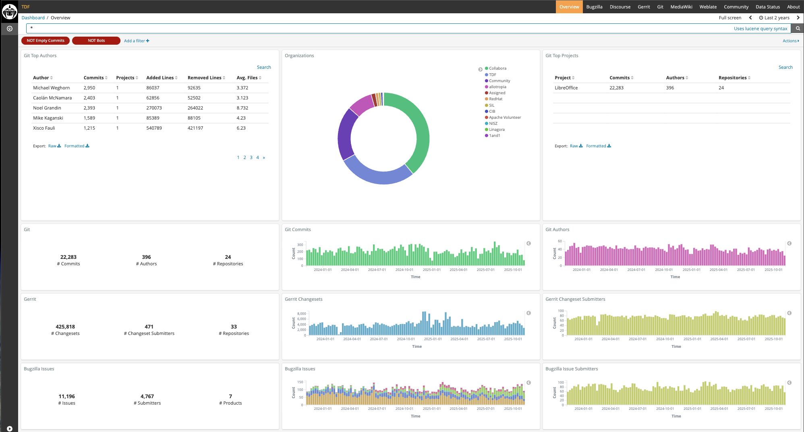
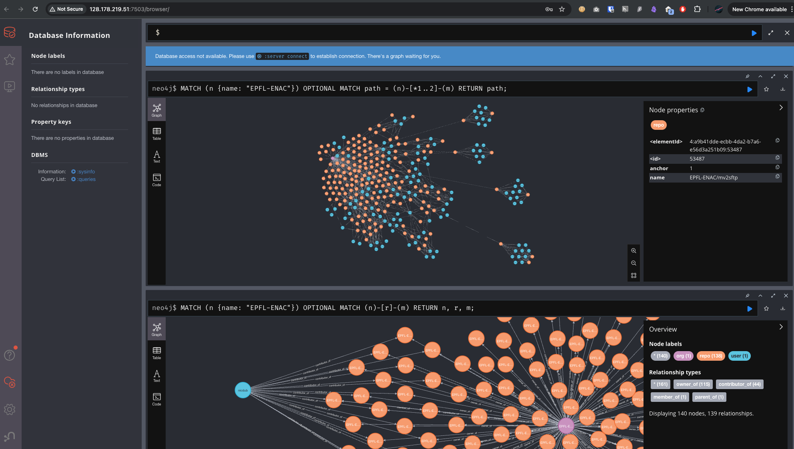
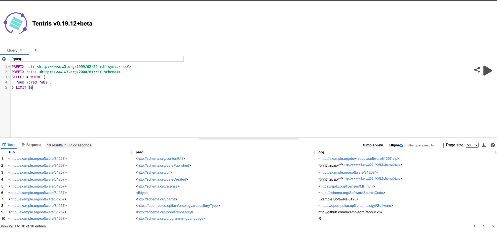
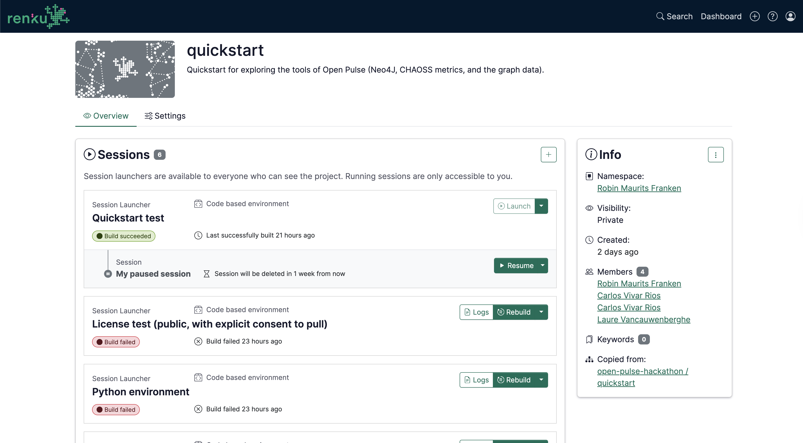

# open-pulse-quickstart

Quickstart for Open Pulse. Tutorials and how-tos

## What's Open Pulse?

Open Pulse is an Open Research Data (ORD) toolset developed by **EPFL Open Science** and the **SDSC**. It automates the discovery and monitoring of open-source software (OSS) produced at EPFL, laying the groundwork for making these contributions visible, measurable, and valued within research institutions.

Unlike traditional metrics, which emphasize volume (e.g., downloads or citations), **Open Pulse** puts **community vitality and engagement** at the center — tracking, for example, how actively software is updated, how often issues are resolved, and how software contributions evolve over time. Furthermore, Open Pulse segments repositories by type and discipline, allowing exploration of metrics related to specific research communities.

The platform brings all the data together into **three complementary components** to help make such community contributions visible and actionable:

| **Component** | **What it’s for?** | **Think of it as…** | **Powered by…** |
|----------------|--------------------|----------------------|------------------|
| **Development metrics** | To keep an eye on how active and healthy a software or research community is. | A live dashboard showing who's contributing, how often, and what they're doing — kind of like tracking the *pulse* of a community. | **GrimoireLab**, a set of open-source tools from the Linux Foundation. |
| **Community network** | To explore relationships between things like code repositories, contributors, and organizations. | A tool to answer questions like “Which people are working across multiple projects?” or “How are different organizations connected?” | **Neo4j**, a graph database, and **Cypher**, a language for querying graphs (like SQL but for networks). |
| **Repositories metadata** | To store and query semantic metadata about repositories — like what field of science they belong to, what license they use, or how FAIR (Findable, Accessible, Interoperable, Reusable) they are. | A smart filing cabinet that lets you ask complex questions like “Show me all repositories in biology that use an MIT License and have a Docker image.” | **Tentris**, a database for linked data, and **SPARQL**, a query language for this type of data. |

By combining these layers, **Open Pulse** provides a foundation for **evidence-based evaluation of open-source contributions**, with an emphasis on **community health, engagement, and relevance** across EPFL’s research landscape.

In this Quickstart we will show you how to start accessing this data

## How to use this Quickstart?

TBD: You can run this quickstart in Renku or in local by using the dockerimage we provide

### Development metrics 

To be extended...

[Link to example](https://dashboard.documentfoundation.org/app/kibana#/dashboard/Overview?_g=()&_a=(description:'Overview%20Panel%20by%20Bitergia',filters:!(('$state':(store:appState),meta:(alias:'Empty%20Commits',disabled:!f,index:git,key:files,negate:!t,params:(query:'0',type:phrase),type:phrase,value:'0'),query:(match:(files:(query:'0',type:phrase)))),('$state':(store:appState),meta:(alias:Bots,disabled:!f,index:git,key:author_bot,negate:!t,params:(query:!t,type:phrase),type:phrase,value:true),query:(match:(author_bot:(query:!t,type:phrase))))),fullScreenMode:!f,options:(darkTheme:!f,useMargins:!t),panels:!((gridData:(h:2,i:'1',w:4,x:0,y:5),id:git_main_numbers,panelIndex:'1',title:Git,type:visualization,version:'6.1.0-3'),(gridData:(h:2,i:'2',w:4,x:4,y:5),id:git_evolution_commits,panelIndex:'2',title:'Git%20Commits',type:visualization,version:'6.1.0-3'),(gridData:(h:2,i:'3',w:4,x:8,y:5),id:git_evolution_authors,panelIndex:'3',title:'Git%20Authors',type:visualization,version:'6.1.0-3'),(gridData:(h:5,i:'5',w:4,x:4,y:0),id:git_commits_organizations,panelIndex:'5',title:Organizations,type:visualization,version:'6.1.0-3'),(gridData:(h:2,i:'6',w:4,x:0,y:7),id:gerrit_main_numbers,panelIndex:'6',title:Gerrit,type:visualization,version:'6.1.0-3'),(gridData:(h:2,i:'7',w:4,x:4,y:7),id:gerrit_evolution_changesets,panelIndex:'7',title:'Gerrit%20Changesets',type:visualization,version:'6.1.0-3'),(gridData:(h:2,i:'8',w:4,x:8,y:7),id:gerrit_evolution_submitters,panelIndex:'8',title:'Gerrit%20Changeset%20Submitters',type:visualization,version:'6.1.0-3'),(gridData:(h:2,i:'96',w:4,x:4,y:11),id:mediawiki_editions,panelIndex:'96',title:'Mediawiki%20Edits',type:visualization,version:'6.1.0-3'),(gridData:(h:2,i:'97',w:4,x:8,y:11),id:mediawiki_editors,panelIndex:'97',title:'Mediawiki%20Editors',type:visualization,version:'6.1.0-3'),(gridData:(h:2,i:'98',w:4,x:0,y:11),id:mediawiki_main_numbers,panelIndex:'98',title:Mediawiki,type:visualization,version:'6.1.0-3'),(gridData:(h:5,i:'111',w:4,x:0,y:0),id:git_overview_top_authors,panelIndex:'111',title:'Git%20Top%20Authors',type:visualization,version:'6.1.0-3'),(gridData:(h:5,i:'112',w:4,x:8,y:0),id:git_overview_top_projects,panelIndex:'112',title:'Git%20Top%20Projects',type:visualization,version:'6.1.0-3'),(gridData:(h:2,i:'113',w:4,x:0,y:9),id:issues_main_metrics,panelIndex:'113',title:'Bugzilla%20Issues',type:visualization,version:'6.1.4'),(gridData:(h:2,i:'114',w:4,x:4,y:9),id:issues_evolutionary,panelIndex:'114',title:'Bugzilla%20Issues',type:visualization,version:'6.1.4'),(gridData:(h:2,i:'115',w:4,x:8,y:9),id:issues_evolutionary_submitters,panelIndex:'115',title:'Bugzilla%20Issue%20Submitters',type:visualization,version:'6.1.4'),(gridData:(h:2,i:'116',w:4,x:0,y:15),id:bd562660-099c-11eb-b2a9-cfa8a0efe987,panelIndex:'116',title:Weblate,type:visualization,version:'6.1.4'),(gridData:(h:2,i:'119',w:4,x:4,y:15),id:'1fe9b9b0-4b9a-11eb-ba3f-e561effddee9',panelIndex:'119',title:'Weblate%20actions',type:visualization,version:'6.1.4'),(gridData:(h:2,i:'120',w:4,x:8,y:15),id:cc367d00-4b97-11eb-ba3f-e561effddee9,panelIndex:'120',title:'Weblate%20contributors',type:visualization,version:'6.1.4'),(gridData:(h:2,i:'121',w:4,x:0,y:13),id:discourse_main_metrics,panelIndex:'121',title:Discourse,type:visualization,version:'6.1.4'),(gridData:(h:2,i:'123',w:4,x:8,y:13),id:discourse_qa_evolutionary_submitters,panelIndex:'123',title:'People%20sending%20Q%26A',type:visualization,version:'6.1.4'),(gridData:(h:2,i:'124',w:4,x:4,y:13),id:discourse_qa_evolutionary,panelIndex:'124',title:'Questions%20and%20Answers',type:visualization,version:'6.1.4')),query:(language:lucene,query:(query_string:(analyze_wildcard:!t,default_field:'*',query:'*'))),timeRestore:!f,title:Overview,uiState:(P-1:(title:Git),P-10:(title:Emails,vis:(legendOpen:!f)),P-100:(title:Meetings),P-101:(title:Representatives%2FCountries),P-102:(title:'-'),P-104:(title:Telegram),P-105:(title:Messages,vis:(legendOpen:!f)),P-106:(title:Participants,vis:(legendOpen:!f)),P-107:(title:'Git%20Pair%20Programming'),P-108:(title:'-'),P-109:(title:Commits,vis:(legendOpen:!f)),P-11:(title:Participants,vis:(legendOpen:!f)),P-110:(title:Authors,vis:(legendOpen:!f)),P-111:(title:'Git%20Top%20Authors',vis:(params:(config:(searchKeyword:''),sort:(columnIndex:!n,direction:!n)))),P-112:(title:'Git%20Top%20Projects',vis:(params:(config:(searchKeyword:''),sort:(columnIndex:!n,direction:!n)))),P-113:(title:'-'),P-114:(title:'-',vis:(legendOpen:!f)),P-115:(title:'Reps%20Activities',vis:(legendOpen:!f)),P-116:(title:'Reps%20Events'),P-117:(title:Reports,vis:(legendOpen:!f)),P-118:(title:Events,vis:(legendOpen:!f)),P-119:(title:Representatives%2FCountries,vis:(legendOpen:!f)),P-12:(title:Issues),P-120:(title:Authors,vis:(legendOpen:!f)),P-121:(title:'-'),P-122:(title:Stars,vis:(legendOpen:!f)),P-123:(title:Pulls,vis:(legendOpen:!f)),P-124:(title:DockerHub),P-13:(title:Issues),P-132:(vis:(params:(config:(searchKeyword:''),sort:(columnIndex:!n,direction:!n)))),P-14:(title:'Issue%20Submitters',vis:(legendOpen:!f)),P-15:(title:Twitter),P-16:(title:Tweets,vis:(legendOpen:!f)),P-17:(title:Users,vis:(legendOpen:!f)),P-18:(title:Stackoverflow),P-19:(title:'Questions%20and%20Answers'),P-2:(title:Commits,vis:(legendOpen:!f)),P-20:(title:Participants),P-22:(title:IRC),P-23:(title:Messages,vis:(legendOpen:!f)),P-24:(title:Participants,vis:(legendOpen:!f)),P-28:(title:Confluence),P-29:(title:Participants,vis:(legendOpen:!f)),P-3:(title:Authors,vis:(legendOpen:!f)),P-30:(title:Editions),P-31:(title:'Github%20Issues'),P-32:(title:'GitHub%20Issues'),P-33:(title:'GitHub%20Issues%20Submitters'),P-34:(title:'GitHub%20Pull%20Requests'),P-35:(title:'Pull%20Requests'),P-36:(title:'Pull%20Request%20Submitters',vis:(legendOpen:!f)),P-37:(title:Jira),P-38:(title:Issues),P-39:(title:Submitters,vis:(legendOpen:!f)),P-40:(title:Issues,vis:(legendOpen:!f)),P-41:(title:Maniphest),P-42:(title:Submitters,vis:(legendOpen:!f)),P-43:(title:Redmine),P-44:(title:Issues),P-45:(title:Submitters,vis:(legendOpen:!f)),P-46:(title:RSS),P-47:(title:Posts),P-48:(title:Authors),P-49:(title:Meetup),P-5:(title:Organizations),P-50:(title:Events),P-51:(title:Participants,vis:(legendOpen:!f)),P-52:(title:Askbot),P-53:(title:'Questions,%20Answers%20and%20Comments',vis:(legendOpen:!f)),P-54:(title:Participants,vis:(legendOpen:!f)),P-55:(title:Discourse),P-56:(title:'Questions%20and%20Answers'),P-57:(title:Participants),P-58:(title:Jenkins),P-59:(title:'Jenkins%20Builds',vis:(legendOpen:!f)),P-6:(title:Gerrit),P-60:(title:'Jenkins%20Active%20Nodes',vis:(legendOpen:!f)),P-62:(title:Hits),P-65:(title:Slack),P-66:(title:'Slack%20Messages'),P-67:(title:'Slack%20Participants'),P-68:(title:'-'),P-69:(title:'-'),P-7:(title:Changesets,vis:(legendOpen:!f)),P-70:(title:'-'),P-71:(title:'-'),P-72:(title:'-'),P-73:(title:'-'),P-74:(title:'-'),P-75:(title:'-'),P-76:(title:'-'),P-77:(title:'-'),P-78:(title:'-'),P-79:(title:'-'),P-8:(title:'Changeset%20Submitters',vis:(legendOpen:!f)),P-80:(title:'-'),P-81:(title:'-'),P-82:(title:'-'),P-83:(title:'-'),P-84:(title:'-'),P-85:(title:'-'),P-86:(title:'-'),P-87:(title:'-'),P-88:(title:'Google%20Hits'),P-89:(title:Hits),P-9:(title:'Mailing%20Lists'),P-90:(title:'Hits%20by%20Keyword'),P-91:(title:'-'),P-92:(spy:(mode:(fill:!f,name:!n)),title:'Apache%20Logs'),P-93:(spy:(mode:(fill:!f,name:!n)),title:'Apache%20Visits'),P-94:(title:'Apache%20Packages'),P-95:(title:'-'),P-96:(title:Editions,vis:(legendOpen:!f)),P-97:(title:Editors,vis:(legendOpen:!f)),P-98:(title:Mediawiki),P-99:(title:'Mozilla%20Club')),viewMode:view))

Link to Grimoire Open Pulse Instance: Waiting for final deployment
Documentation: https://chaoss.community/
CHAOSS Metrics: https://chaoss.community/kbtopic/metrics-and-metrics-models-by-topic/

### Community Network

To be extended....

Link to Neo4j Open Pulse Instance: 
Documentation: https://neo4j.com/docs/
Cypher Tutorial: 

#### CSV Example dataset

As an alternative to the interaction with NEO4j we compiled a subset of the graph in csv format which can be found in  `data/community-network`. 

### Repositories Metadata

To be extended....

Mention Federated queries with Wikipedia

Link to Tentris Open Pulse: http://128.178.219.51:7502/ui
Documentation: https://docs.tentris.io/
SPARQL Tutorial: https://sparql.dev/

#### Document based Metadata

As an alternative to SPARQL we compiled the metadata in a much more familiar formar and included a subset in `data/entities-metadata`

## How to participate in the Mini-Hackathon using Renku?

TBD: Describe here the user flow including Renku use. 

Link to Renku Project: https://renkulab.io/p/robin.franken-1/quickstart
Jupyter Hub Documentation: https://jupyterhub.readthedocs.io/en/stable/

## How to submit your project?

TBD..

## Credits

TBD.